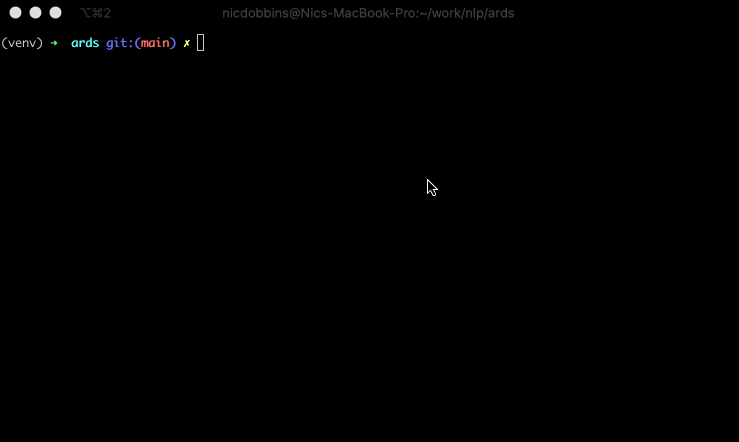

# A PyTorch Wrapper of Hierarchical Attention Network with Sentence Objectives Framework for ARDS Identification
This repository implements a high-level wrapper using Python3 and PyTorch of methods described in the paper [Identifying ARDS using the Hierarchical Attention Network with Sentence Objectives Framework](https://arxiv.org/abs/2103.06352). 

The project was developed by [Professor Meliha Yetisgen and Dr. Kevin Lybarger of UW-BioNLP](http://depts.washington.edu/bionlp/index.html?people) and collaborators at the [University of Washington](http://www.washington.edu/).

<p align="center"></p>

# Usage
- **Input** - Chest X-Ray findings as `.txt` files
- **Output** - Predictions for ARDS-related information as `.json` files

The [main.py](main.py) script provides a convenient means of applying the classifier on a directory of **Chest X-ray** notes as `.txt` files. Running the tool produces an output for each Chest X-ray note that 
1. Predicts opacities (increased radiodensity) 
2. Classifies them as parenchymal (indicative of alveolar edema/infiltrates) or extraparenchymal (outside the lungs or not indicative of alveolar edema/infiltrates) 
3. Resolves laterality (unilateral or bilateral)

The `.json` output for each document's predictions is of the form:

```json
{
    "infiltrates": "none" "present" "unilateral" "bilateral",
    "extraparenchymal": "none" "present" "unilateral" "bilateral"
}
```

# Requirements
 - Python version >= 3.6
 - PyTorch version >= 1.6.0
 - Transformers >= 4.0.1

 See [requirements.txt](requirements.txt) for additional dependencies.

# Installation
1. Clone the repository

```sh
$ git clone git@github.com:uw-bionlp/ards.git
```

2. As the trained model for this code is not included in the repository, please contact contact Professor Meliha Yetisgen [melihay@uw.edu](mailto:melihay@uw.edu) to gain access to the model. Copy the model files to `/ards/model`.

3. Install Python3 dependencies. We recommend doing so using a virtual environment:

```sh
$ cd /ards
$ python3 -m venv venv
$ source venv/bin/activate
$ python3 -m pip install -r requirements
```

4. Download the spaCy english language model

```sh
$ python3 -m spacy download en
```

5. Run the tool on a directory of Chest X-ray notes as `.txt` files:

```sh
$ python3 main.py <your_notes_directory>
```

You can also specify the additional parameters
- `--output_path`, which outputs your files to a specify location (rather than a default `/output/<dir_name><current_timestamp>` directory)
- `--output_single_file`, which can alternatively output a single `.jsonl` file with each row in the file representing an input file's output
- `--batch_size`, which specifies the number of note batches to predict at a time. If unspecified, this defaults to `8`.